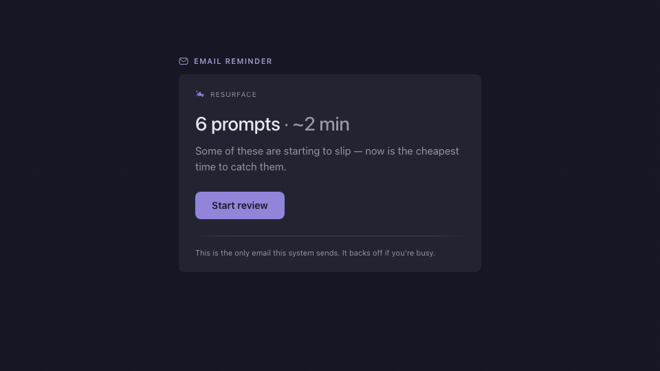

# spaced-repetition

People are _**surprisingly**_ bad at retaining what they read (here's a [good article](https://andymatuschak.org/books/) on the topic by Andy Matuschak).

After searching high and low, there doesn't appear to be any existing flashcard or spaced-repetition apps on the market that solves the following problems:

1. Make it low-effort to capture the raw context around something you'd like to remember (e.g. when reading physical/digital books, pdfs, webpages, conversations with an AI, podcasts, etc). 
2. Helps you to refine that raw context into a pedagogically correct memory prompt (e.g. a flashcard, or a progressive memory prompt).
3. Optimizes between the goals of minimizing review time, maximizing recall and retention, while also making deliberate memory management a sustainable long term practice that respects your attention.

I tried [Mochi](https://mochi.cards/) & [Anki](https://apps.ankiweb.net/), but they both assume a primary use case where you've got their app open, and your focus is centered on either creating or reviewing flash cards. They don't really help you make memory management a sustainable practice, nor do they treat the notification channel as a first class citizen (e.g. notifying you sparingly, based on some kind of optimal spaced-repetition schedule).

This project is heavily inspired by [Orbit](https://github.com/andymatuschak/orbit). However, Orbit is primarily a research/learning prototype whose main audience is content creators who want to write articles in the "mnemonic-medium" style (like [Quantum Country](https://quantum.country/)).

At a high level, this project is one Cloudflare Worker with a few companion UI surfaces. It helps you capture ideas without interrupting reading, preserves the work of deliberate prompt authoring (since research shows that's where a lot of the learning/processing is happening), and schedules review sessions using a longitudinal model of the learner’s memory.



# Design principles

- Capturing context should be nearly effortless. 
- Refinement of captured context into retrieval prompts should be meaningfully effortful.
- Design for sustainable long-term use (e.g. no gamified metrics).
- You own your data.
- Built as personal infrastructure, not as a service.

# How adaptive learning works

Each prompt has its own evolving memory model. After a review, **Remembered** or **Forgot** updates the model's estimate of how stable that memory is, then schedules the next review based on your chosen retention target. Forgotten prompts show up again sooner; stable memories take longer to resurface. We only notify when a useful session has accumulated or waiting longer is likely to hurt recall.

# Operator Manual

[](https://deploy.workers.cloudflare.com/?url=https://github.com/NickCiao/spaced-repetition)

That provisions D1 + R2 and runs database migrations. When Cloudflare asks for `SR_TOKEN`, generate and save a long, unique access key in your password manager, then paste it into the field. After deployment, open `https://<your-worker>/` and sign in from the login page — paste the token once, or (after email is configured in Settings) use **Email me a sign-in link** on any new device. Each browser signs in once; a cookie handles auth from then on.

**Or from a clone:**

```bash
npm install
npm run setup    # login → D1/R2 → migrate → SR_TOKEN → deploy
```

Email is configured in **Settings** after deploy (Resend API key + destination). `EMAIL_FROM` defaults to Resend’s test sender with a friendly display name (`Resurface <onboarding@resend.dev>`); you can override this by running `npx wrangler secret put EMAIL_FROM` (after verifying the domain in Resend — keep the `Name <address>` format so inboxes show a sender name).

On the phone: open `/capture`, then Share → Add to Home Screen.

## Commands

| Command | What |
|---------|------|
| `npm run setup` | First-time production: D1, R2, migrations, `SR_TOKEN`, deploy |
| `npm run dev` | Local dev server (`http://localhost:8787/?token=devtoken`) |
| `npm test` | Test suite |
| `npm run migrate:local` | Apply D1 migrations locally |
| `npm run migrate:remote` | Apply D1 migrations to production |
| `npm run deploy` | Migrate remote + deploy worker (secrets unchanged) |
| `npm run deploy:safe` | `npm test` then deploy |
| `npm run db:wipe:local` | Wipe local D1/R2 state and re-migrate |
| `CONFIRM=yes npm run db:wipe:remote` | Wipe production D1 + R2 (see below). Optional: `WIPE_SETTINGS=yes` clears settings. |

## Local dev

```bash
npm install
cp .dev.vars.example .dev.vars
# Edit .dev.vars and set SR_TOKEN=devtoken for local development
npm run migrate:local
npm run dev
npm test
```

`npm run db:wipe:local` resets local D1/R2 state. The dev server also exposes the reminder cron:

```bash
curl "http://localhost:8787/__scheduled?cron=0+*+*+*+*"
```

## iOS share-sheet Shortcut

The share-sheet shortcut is the fast path for capturing a Safari highlight without opening the app. Setup is fiddly because Shortcuts hides variable wiring inside nested pickers — follow the steps below rather than trying to cram everything into one **Get Contents of URL** action.

**Prereqs:** your worker URL and `SR_TOKEN`. Sanity-check before opening Shortcuts:

```bash
curl -s -X POST "https://<your-worker>/api/capture" \
  -H "Authorization: Bearer <SR_TOKEN>" \
  -H "Content-Type: application/json" \
  -d '{"text":"shortcut test"}'
# → {"ok":true,"id":"..."}
```

**Build the shortcut** (Shortcuts → + → name "Capture"):

1. **Ask for Input** — Text, prompt `Note (optional)`, allow empty.
2. **Get Text from Input** — input: **Shortcut Input** (the shared text or page).
3. **If** **Text** (step 2) **has any value** → **Otherwise**:
   - In Otherwise: **Ask for Input** — Text, prompt `What's worth keeping?`
   - Use **Provided Input** from this ask as capture text when testing from the Shortcuts app (Shortcut Input is empty when you tap-run).
4. **Get URLs from Input** — input: **Shortcut Input**.
5. **Get Item from List** — list: **URLs** (step 4), first item only.
6. **Get Name from Input** — input: **Shortcut Input** (page title when sharing a Safari web page; empty for plain text — fine).
7. **Get Contents of URL**:
   - URL: `https://<your-worker>/api/capture`
   - Method: POST
   - Header: `Authorization` → `Bearer <SR_TOKEN>` (literal token, include the `Bearer ` prefix)
   - Request Body: **JSON** with keys:
     - `text` → capture text from step 3 (**Text** from step 2, or **Provided Input** from the fallback ask)
     - `note` → **Provided Input** from step 1
     - `url` → **Item** from step 5
     - `title` → **Name** from step 6
     - `topic` → optional; a topic name to file the capture under (refine pre-selects it)
8. (Optional) **Show Result** — confirms `{"ok":true,...}` on success.


## Refactor loop (export → edit → import)

```bash
curl -H "Authorization: Bearer $SR_TOKEN" -o export.zip https://<your-worker>/export.zip
# unzip, edit prompts/*.md (one file per topic; keep the <!-- id --> comments; delete one to mint a new card), re-zip
curl -H "Authorization: Bearer $SR_TOKEN" --data-binary @export.zip "https://<your-worker>/import?apply=0"   # dry-run diff
curl -H "Authorization: Bearer $SR_TOKEN" --data-binary @export.zip "https://<your-worker>/import?apply=1"   # apply
```

Each prompt block may carry an optional `S:` line — its source attribution, one line of markdown (e.g. `S: [Raft paper](https://raft.github.io/raft.pdf)`) — after the answer, before the id comment. Zips exported before the topic rename (frontmatter `source:` instead of `topic:`) still restore.

Restore onto a blank deploy: `.../import?apply=1&restore=1`.

The export zip includes `retired.jsonl` (retired prompts' content archive). To un-retire a prompt, re-add its block with its `<!-- id -->` comment into its topic file during import. **Delete** (review overflow or edit page) removes a prompt and its review history permanently — it will not appear in export and cannot be undone through the app (only an older backup zip could bring it back).

## Backup

Manual by design: Settings → **Export everything** (or the curl above), whenever you think of it. D1 Time Travel adds an in-vendor safety net — point-in-time restore for 30 days on Workers Paid, 7 days on Free.

## Key References
https://augmentingcognition.com/ltm.html

https://gwern.net/spaced-repetition

https://withorbit.com/

https://github.com/andymatuschak/orbit
