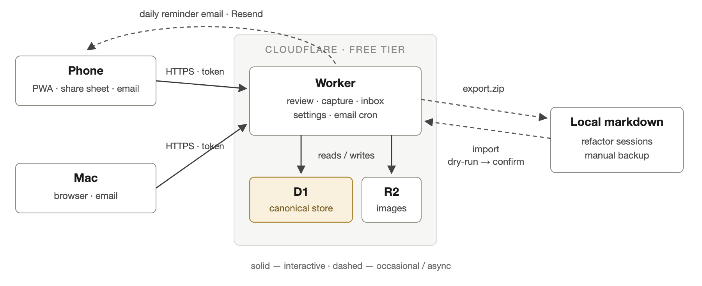

# Spaced Repetition — Design

**Status**: Draft for review · 2026-08-20
**Owner**: Nick Chow

## 1. Goal

Reading currently leaves behind a vague gist: details fade within days, so understanding stays approximate and doesn't compound. This tool makes the ideas and details Nick cares about durably available to thought, so that understanding of what he reads becomes more accurate, connected, and cumulative over time.

What good looks like: a review practice that remains sustainable for years. Nick stays in control of what is worth remembering; prompts evolve, get refactored, or disappear as interests and understanding change. The system optimizes for a sustained, useful practice — never for cards-reviewed counts or theoretical maximum retention.

The design draws on Matuschak and Nielsen's mnemonic-medium work: retrieval practice as the mechanism, prompts as first-class objects of authorship, review friction near zero, and reminders that respect attention. It adapts those principles for a single-user personal tool rather than reproducing any existing system.

## 2. The practice

The tool serves four loops, in decreasing frequency:

| Loop | When | Where | Duration |
|---|---|---|---|
| **Review** | ~daily, from an email nudge | phone or Mac | ~2 min |
| **Capture** | mid-reading, the moment something matters | share sheet or PWA | seconds |
| **Refine** | every few days, clearing the inbox | any device | minutes |
| **Refactor** | occasionally | Mac, files + editor or agent | as needed |

**Capture** is raw material, not commitment: a quote, a rough thought, a half-formed question. It must never meaningfully interrupt reading, so it carries no structure — no tags, no categories, no decisions. Deleting a capture unrefined is legitimate triage.

**Refine** is where the learning happens: turning a capture into one or more atomic question/answer prompts. Writing one's own prompts is elaborative encoding — the act of formulating the question is itself the deepest engagement with the material — so the tool assists this step but never removes it.

**Review** is retrieval practice: attempt recall, reveal, grade honestly with a binary signal. Sessions are short, capped, and guilt-free.

**Refactor** is bulk maintenance — splitting, rewording, retiring across many prompts — done on exported files with a real editor or with agent help, then imported back.

## 3. Architecture

One deployable artifact: a Cloudflare Worker (TypeScript) with a D1 database and an R2 bucket for image assets. D1 is canonical for everything — prompts, sources, captures, the review log, settings — with R2 holding the images prompts reference. There is no CLI, no local daemon, and nothing on any personal machine that must be alive for the system to work.

<!-- Diagram source: architecture.svg. Regenerate the PNG after editing it:
     "/Applications/Google Chrome.app/Contents/MacOS/Google Chrome" --headless --disable-gpu \
       --force-device-scale-factor=2 --window-size=900,368 --screenshot=architecture.png architecture.svg -->

The web app is server-rendered HTML with minimal vanilla JS, mobile-first. The capture page is an installable PWA with a cached shell and an offline queue. Prompt bodies are markdown — code blocks, images, and math — rendered by a small markdown renderer plus self-hosted KaTeX (no CDN, so rendering keeps working for years; raw HTML is escaped, never rendered). Runtime dependencies: `ts-fsrs`, the markdown renderer, KaTeX as static assets. Email goes through Resend behind a ~20-line provider interface. Running cost: $0 on the Workers, D1, and R2 free tiers.

**Auth**: one long bearer token, stored as a Worker secret. Email links carry it as a query parameter (which sets a cookie); scripts send it as a header. There are no accounts. Rotation = update the secret; old links die.

The `spaced-repetition` repo contains only the tool — code and docs, no personal data — and is shareable. Personal data lives in D1 and in manually downloaded export zips.

## 4. Key decisions

| Decision | Choice | Rationale |
|---|---|---|
| Canonical store | D1 (cloud) | Every frequent loop (capture, review, quick refine) closes on whatever device is at hand; nothing local must stay alive. The alternative — local files as truth with a sync layer — binds refinement to the Mac and adds a sync seam with its own failure modes. |
| Client software | None — worker endpoints only | Export/import are HTTP endpoints, so the file-format parser exists exactly once, server-side. Clients are a browser and curl. |
| Scheduling | FSRS (`ts-fsrs`, default weights) | One meaningful dial (desired retention) instead of hand-tuned interval knobs; principled handling of late reviews; the review log is exactly the training data for fitting personal weights later. |
| Grades | Binary: Remembered → Good, Forgot → Again | Two thumb-sized buttons keep review friction near zero; FSRS explicitly supports pass/fail use. Granularity is not worth the decision cost per card. |
| Prompt identity | Short server-assigned IDs, embedded as `<!-- id: … -->` in exports | Identity survives rewording, so prompts can be polished freely without resetting their scheduling history. Dropping the ID deliberately makes a fresh card; deleting the prompt retires it. |
| Interchange format | Markdown, one file per source; `Q:`/`A:` pairs and `C:` cloze blocks (`{{…}}` spans) | Human-writable, agent-friendly, meaningful without the tool. The exit hatch is a folder of readable text. |
| Cloze granularity | One cloze block = one card; all spans masked together | Separate scheduling means writing separate lines. Avoids Anki-style sub-card numbering, so the one-ID-per-prompt identity scheme survives untouched. |
| Images | R2 via worker binding, referenced from prompt markdown | Binary assets belong in object storage, not in D1 rows or base64 markdown. The export zip carries them, so the exit hatch stays complete. |
| Math | KaTeX with self-hosted assets, `$…$` / `$$…$$` | Technical reading needs it; self-hosting avoids a CDN dependency that could rot or vanish. |
| Sources | Free-text name + optional URL | Books, papers, PDFs, podcasts, and chat conversations are all just descriptions; a URL adds a link when one exists. Unknown frontmatter fields pass through untouched. |
| Reminders | Daily email; decays to weekly when ignored | The proven Quantum Country pattern: a tiny framed commitment ("6 prompts · ~2 min") with a deep link. After 4 consecutive un-actioned daily reminders, cadence drops to weekly until the next review, then resumes. The reminder respects attention rather than fighting for it. |
| Backup | Manual export only, plus D1 Time Travel (30-day PITR) | Deliberate simplicity: no mirror repos, no snapshot automation, no tokens to rotate. Accepted risk, recorded in §9: changes since the last manual export are exposed to catastrophic vendor/account loss. |
| Metrics | None | No streaks, no stats, no counters. The only numbers ever shown are what's due now and when the next review lands. |

## 5. Content model

Field-by-field shapes live in code; the entities and their meaning:

- **Source** — a thing read or heard: free-text name, optional URL, arbitrary passthrough metadata. Groups prompts; renders as the attribution line during review.
- **Prompt** — an atomic question/answer pair or cloze text (markdown: code, images, math), belonging to a source, carrying FSRS memory state, a retired flag, and an optional flag-note (set during review when something reads wrong).
- **Asset** — an uploaded image, stored in R2 and referenced from prompt markdown; exported and re-imported alongside everything else.
- **Capture** — raw inbox material: text plus optional URL/title/annotation, pending until consumed by refinement or deleted.
- **Event** — an append-only review log entry: timestamp, prompt, action (remembered / forgot / skip / flag / retire), and resulting state. The log is the authoritative history; all scheduling state is derivable by replaying it through FSRS.
- **Settings** — session cap (default 20), desired retention (default 0.9), reminder hour, timezone.

## 6. Scheduling

FSRS via `ts-fsrs` with default weights, desired retention 0.9, fuzz enabled. New prompts surface about three days after creation (the default-weight consequence, not a configured value). Late reviews are handled natively: retrievability is computed from actual elapsed time, so remembering something long overdue yields a larger stability gain — a backlog self-resolves upward rather than punishing the lapse.

A session is simply what's due — ordered weakest predicted recall first, capped at the session cap. The cap bounds a sitting, not the backlog: the end screen offers "N more due — keep going?" and nothing expires. Because sessions are just queries over D1 state, they are device-interchangeable mid-session by construction: three cards graded on the phone leave the remaining three waiting at the Mac, with nothing to hand off.

When the review log is large enough (~1,000+ events), personal FSRS weights can be fitted offline from an export and swapped in. Out of scope for v1; the data model makes it a config change, not a migration.

## 7. Surfaces

- **Review** — one card at a time: question → reveal (tap, or Space) → answer with source line → **Forgot / Remembered** (thumb buttons; ← / → on desktop). Cloze cards show the text with spans masked as […] and reveal in place with the deletions highlighted; both sides render full markdown — code, images, math. Per-card overflow: Skip (no schedule change), Flag (with a note; lands in the inbox), Retire, Edit (opens the prompt editor in place). When nothing is due: "Nothing due. Next: Thursday (4 prompts)."
- **Capture** — a text box, an optional photo (a diagram from a paper book; downscaled client-side before upload), an optional source field that autocompletes from existing sources (a book captured against repeatedly costs one typing of its name), Save, "Saved ✓", today's captures listed beneath. Installable to the phone home screen; the shell is cached, and offline saves queue in localStorage and flush on reconnection. This is the path that works in airplane mode.
- **Share-sheet Shortcut (iOS)** — select text in Safari / a PDF / Kindle → Share → Capture: POSTs the selection plus page title and URL, after asking for an optional one-line annotation (one tap skips). Online-only by nature; it fails loudly without signal, and the PWA is the offline fallback. Setup (~5 steps, token pasted once) documented in the README — no app to build.
- **Inbox** — pending captures and flagged prompts in one list; the only to-do surface. Tapping a capture opens the refine editor: write one or several prompts (Q/A or cloze), paste or attach images, with a preview toggle so math and cloze masking are visible before saving; source pre-filled from the capture's URL/title where possible; saving consumes the capture. Empty inbox = caught up. Nothing nags about inbox age.
- **Browse** — prompts grouped by source; edit, retire, or add a prompt directly (authoring does not require a capture).
- **Settings** — the four settings, a "Download everything" export link, and the import upload.
- **Email** — one daily cron at the configured hour: if anything is due, one message — "6 prompts due · ~2 min" (time estimated at ~20s/card) — deep-linking into the session. Nothing due, no email. Cadence decay per §4.

## 8. Export, import, restore

**Export** (`GET /export.zip`, and the settings-page link): one markdown file per source in the interchange format, an `assets/` folder holding referenced images, `log/reviews.jsonl`, pending captures, and settings. The zip is the complete system state minus secrets.

**Import** (upload endpoint): treats the upload as the desired content state, matched by embedded ID — missing IDs become new prompts, absent prompts are retired, text changes are edits. It is a **dry-run by default**, responding with the full diff ("3 edited, 2 new, 1 would be retired"), and applies only on explicit confirm; a stale or partial zip cannot quietly destroy content. Parse failures reject the whole import with file and line numbers.

**Restore** = deploy a blank worker, upload an export, confirm; assets land back in R2, and review events replay through FSRS (using recorded timestamps) to rebuild all scheduling state.

**The refactor loop** — including future agent-assisted refinement — is export → edit the markdown (human or Claude Code) → import. Two curl one-liners in the README; the interchange format is the whole integration surface.

## 9. Failure modes

| Failure | Behavior |
|---|---|
| Import parse error or duplicate ID | Whole import rejected with file/line detail; nothing partial applied |
| Email provider down | Cron fires again next day; review is never blocked on email |
| Accidental data damage | D1 Time Travel: point-in-time restore within 30 days |
| Vendor/account loss | Restore from the latest manual export. **Accepted gap**: anything since that export is lost. Chosen deliberately for simplicity; revisit if the export habit proves rarer than assumed. |
| Leaked token | Rotate the Worker secret; all old links and cookies die |
| Capture while offline | PWA queue, flushed on reconnection; share-sheet path fails loudly rather than pretending |

## 10. Testing

TDD throughout. The highest-risk logic is pure and tested first: golden tests for the FSRS wrapper (fixed review sequences → expected states), property tests for the interchange format (parse ∘ render round-trips, cloze spans included), unit tests for the import differ (new / edited / retired) and the reminder cadence rules. Worker handlers get integration tests against a local D1 via vitest and wrangler's test pool.

## 11. Out of scope for v1

Agent-drafted prompts (the export/import loop already supports the workflow; no software needed yet) · typed answers · stats or gamification of any kind · multi-user · FSRS weight fitting · voice capture (same endpoint, whenever wanted) · automated backup.

## 12. Future directions

Three extensions the design leaves room for, none of which require rework: **agent-assisted refinement** (Claude drafts prompts from captures via the refactor loop; Nick curates); **personal FSRS weights** fitted from the review log; and **progressive memory prompts** — prompts whose content changes over time in a programmed, author-defined sequence, e.g. deepening from recognition toward application and connection as recall succeeds. Prompt identity plus the append-only event log already give each card the history needed to drive stage advancement, so this is a format extension (a staged prompt variant in the interchange files), not a rework.
